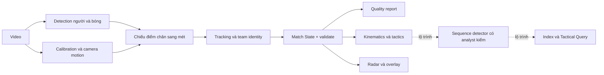

# footlytics — Các góc kỹ thuật được chọn cho landing

08/10/2026 · Bản 0.2 · Ưu tiên kỹ thuật theo yêu cầu người dùng.
Mã local: `f9bbcc1ddf4e92596d1adfc6bff5852b04e9cff1`. Nguồn cập nhật: `thanhtrnnn/footlytics` tại `2f584af8046b0643f4ea7d73093d28a38d90e5a5`, tài liệu kỹ thuật/feasibility 23/09/2026. Local và remote khác phiên bản; số F2 từ remote không được gán cho lượt chạy local.

## Luận điểm

Từ video sang hệ toạ độ sân, rồi sang dữ liệu có thể kiểm tra và dùng lại cho phân tích. Điểm đáng trình bày là hình học, bù chuyển động camera, tracking trong mét và kiểm chất lượng; Tactical Query nối tiếp kiến trúc này nhưng chưa là sản phẩm hoàn chỉnh.

## Chọn góc và độ sâu

| ID | Góc chọn | Câu hỏi kỹ thuật | Visual/đầu ra | Vị trí |
|---|---|---|---|---|
| FT01 | Match State là hợp đồng dữ liệu | Làm sao thay detector mà analytics không phải đọc lại pixel? | Pipeline + schema và Parquet thật | Chính |
| FT02 | Calibration DLT + TPS | Điểm ảnh biến thành vị trí mét bằng cách nào? | Landmark → feet projection → sân; residual có nhãn | Chính |
| FT03 | Camera lia/zoom/cắt cảnh | Làm sao hạn chế drift và nhận biết mất calibration? | KLT + SIFT re-anchor, timeline frame bị loại | Chính |
| FT04 | Detector cầu thủ/bóng | Vì sao bóng nhỏ cần xử lý riêng? | Frame + box + footprint; cấu hình detector | Mở rộng |
| FT05 | Tracking trên sân | Vì sao dùng mét và giới hạn chuyển động thay pixel? | Kalman [x,y,vx,vy] + Hungarian + appearance | Chính |
| FT06 | Identity và tracklet | Làm sao nối mảnh mà hạn chế ghép sai người? | Tracklet trước/sau, jersey veto, quota đội | Mở rộng |
| FT07 | Kinematics và tactics | Jitter ảnh hưởng tốc độ/quãng đường thế nào? | Raw/smoothed cùng track; width/depth khối đội | Chính |
| FT08 | Quality và giới hạn | Bao nhiêu frame đủ điều kiện, số nào cần GT? | quality report + mẫu số + compute + ca lỗi | Chính |
| FT09 | Tactical Query L0–L5 | Từ dữ liệu vị trí đến tìm chuỗi chiến thuật còn thiếu gì? | Các lớp đã có/đang xây, query concept có nhãn | Chính, roadmap |
| FT10 | Kiến trúc mở rộng | Đầu ra nào giúp tích hợp event feed và workflow analyst? | Data contract + adapter được đề xuất | Mở rộng/startup |

## Kiến trúc để dựng visual

Sơ đồ rút gọn trách nhiệm, không cam kết toàn bộ chuỗi tự động với mọi video. Camera mất calibration có thể bị bỏ detection; tracking coast có giới hạn, cut dài gây phân mảnh.

## Cơ chế và nguồn mã

**Data contract.** `footlytics/state/schema.py`: TRACK_SCHEMA 17 cột; frame, thời gian, track/role/team/jersey, bbox/confidence, x/y/z, speed/accel. Gốc tâm sân, x dọc sân, y ngang sân; lưu `tracks.parquet` + `meta.json`, có `validate()`. Analytics thao tác DataFrame trong mét. `validate()` sạch là kiểm cấu trúc/điều kiện dữ liệu, không tự chứng minh vị trí đúng ground truth.

**Calibration.** `geometry/pitch.py` mô hình sân với 35 landmark; `geometry/homography.py` dùng DLT và TPS để hiệu chỉnh méo còn lại. Chọn điểm chân từ bbox để chiếu xuống sân. Cần landmark/calibration cho camera và kiểm overlay. Residual trên chính landmark fit không đại diện sai số tracking toàn sân; không quảng cáo tự hiệu chuẩn toàn bộ video.

**Camera motion.** `geometry/camera_motion.py`: AnchoredCamera dùng KLT và SIFT neo lại; MovingCalibration đưa điểm frame hiện tại về frame neo bằng inverse homography rồi qua calibration, giữ TPS. Keyframe/re-anchor hạn chế tích luỹ drift; frame không xác định được phép chiếu không được dùng như dữ liệu mét hợp lệ. Fixed camera là trường hợp phép biến đổi gần identity; không phải bảo đảm hỗ trợ mọi broadcast cut.

**Detection.** `perception/detect.py` hỗ trợ tile YOLOv8x6 fine-tune SoccerNet và pass bóng riêng độ phân giải cao. Cấu hình thử F2 dùng tile=0/1280 cho người + bóng riêng 1920, stride 1; không nói tiled inference đã chạy trong benchmark đó. Chất lượng detector ảnh hưởng mọi lớp sau.

**Tracking.** `perception/track.py`: Kalman [x,y,vx,vy] trong mét, Hungarian assignment, appearance và gate vận tốc. Ngưỡng vận tốc là tham số mô hình, không phải định luật hay chứng minh identity. Mất detection/calibration và giao cắt vẫn có thể đổi ID.

**Identity.** `perception/identity.py`: nối tracklet, dùng số áo để veto ghép mâu thuẫn nếu có lượt đọc, quota đội theo thời gian. Interface nhận jersey reads không chứng minh đã có OCR số áo hoàn thiện. Không cam kết giữ đúng 22 người xuyên trận hoặc tách trọng tài ổn định.

**Kinematics/tactics.** `analytics/kinematics.py`: Hampel loại spike, làm mượt trước đạo hàm/tổng quãng đường; mặc định add_kinematics làm mượt 0.8 s. `analytics/tactics.py`: block width/depth/centroid, formation, press_distance, transitions; các hàm cần đúng dữ liệu đầu vào. Possession hiện lấy từ ballStatus/event feed, chưa suy ra đầy đủ từ video. PPDA cần events; press_zone cần đối chiếu mã phiên bản triển khai trước công bố, không mô tả tham số trong chữ ký như capability đã kiểm.

**Quality.** `pipeline/quality.py`, `pipeline/radar.py`, `cli.py`: report máy đọc và người đọc, frame calibration, presence, re-anchor, đầu ra radar/overlay. Tỷ lệ có bóng khác detection accuracy, sai số vị trí và ID accuracy. Mỗi report phải đi cùng clip/lượt chạy.

## Số đo được chọn: F2, 23/09/2026

Nguồn: [feasibility.md §3.4](https://github.com/thanhtrnnn/footlytics/blob/2f584af8046b0643f4ea7d73093d28a38d90e5a5/docs/feasibility.md). Đây là số ghi trong tài liệu kỹ thuật, chưa được chạy lại trong lượt soạn landing; cần ghép artifact/report gốc ở CP2.
Tactical cam Brazil–France, YOLOv8x6 tile=0/1280 + bóng riêng 1920, stride 1, M2. Các dòng 30 giây và 3 phút là các cửa sổ khác nhau, không ghép thành một tỷ lệ.

| Chỉ số | Kết quả | Điều cần đặt cạnh số |
|---|---|---|
| Presence bóng, clip 30 giây | 745/750 frame = 99.3% | Có bóng trong output, chưa là accuracy/GT |
| Presence bóng, clip 3 phút | 3605/3657 frame có calibration = 98.6% | Trên toàn clip là 80.1%; cut cảnh 34 giây bị loại |
| Calibration, clip 3 phút | 81.23% frame; 139 re-anchor | Còn đoạn không chiếu được sang sân |
| Identity, clip 3 phút | 261 raw track → 179 tracklet | Phân mảnh còn nhiều; không nói nhận diện 22 người ổn định |
| Compute, cấu hình có model bóng | Khoảng 595 giây xử lý/phút trận trên M2 | Offline, không là real-time; chưa ngoại suy 90 phút/GPU |

Không dùng 99.3% làm hero khi caption chỉ nói “AI accuracy”. Chọn panel kết quả theo một clip và công bố cả phần thiếu dữ liệu. Benchmark tổng hợp, GT SoccerTrack/Alfheim và residual landmark thuộc phạm vi khác; chỉ mở rộng khi có manifest riêng, không dùng để nâng số F2.

## Một bài học kỹ thuật nên đưa lên trang

**Bóng gần biên biến mất vì bộ lọc, dù detector nhìn thấy.** F2 ghi nhận dùng lề sân cầu thủ cho bóng làm mất output; sửa `ball_margin_m` riêng đưa presence clip 30 giây từ 11.7% lên 99.3%. Trình bày frame trước/sau cùng cấu hình khác duy nhất nếu có artifact; nếu chỉ có tài liệu, dùng case study có link nguồn và ghi là báo cáo lịch sử. Presence tăng không tự chứng minh sai số toạ độ giảm. Góc này giúp người đọc thấy lỗi có thể nằm ở geometry/filter, không chỉ model.

## Tactical Query: lộ trình phải có nhãn

L0 video → L1 Match State → L2 đặc trưng hình học/động học đã có nền tảng. L3 possession độc lập event feed, L4 sequence label có analyst xác thực và L5 index/query nhiều trận còn thiếu để đạt tầm nhìn sản phẩm.
DuckDB index, truy vấn chuỗi high press/low block, clip sync và vòng rule→analyst→classifier là hướng thiết kế. Không đưa kết quả giả như “18 chuỗi high press” vào demo thật. Nếu minh hoạ query, ghi rõ concept ở ngay kết quả.
Nguồn: [tactical-query-vision.md](https://github.com/thanhtrnnn/footlytics/blob/2f584af8046b0643f4ea7d73093d28a38d90e5a5/docs/tactical-query-vision.md).

## Demo cần chuẩn bị

Một clip có quyền công bố và manifest → frame/video đồng bộ radar → calibration/dropout timeline → bảng Match State thật → quality report của chính lượt chạy. Sau đó mở một track raw/smoothed và một case identity khó. Chỉ chọn frame đẹp là chưa đủ để chứng minh pipeline.
Manifest cần commit/model/weights/config, camera/độ phân giải/fps/stride, thời lượng/mẫu số, ngày, quyền footage, tên artifact thật và giới hạn. Không tự tạo Parquet/trace giả; mockup UI dùng nhãn minh hoạ.

## Không chọn làm lời hứa hiện tại

Realtime, phân tích 90 phút đã nghiệm thu, tự hiểu chiến thuật mọi trận, OCR số áo hoàn thiện, possession tự suy ra, multi-camera fusion, ID accuracy 99%, CLB đang dùng, mọi footage có quyền công bố. Không liệt kê feed adapter hay DuckDB như tích hợp đã vận hành nếu mới là kiến trúc đề xuất.

## Thứ tự lên trang

Hero + video/radar → pipeline/Match State → calibration/camera → tracking/identity → analytics → quality/engineering lesson → Tactical Query có nhãn → startup/pilot. Chi tiết công thức/schema/config để trong disclosure ngay section liên quan; không đẩy toàn bộ nội dung kỹ thuật ra khỏi landing.
